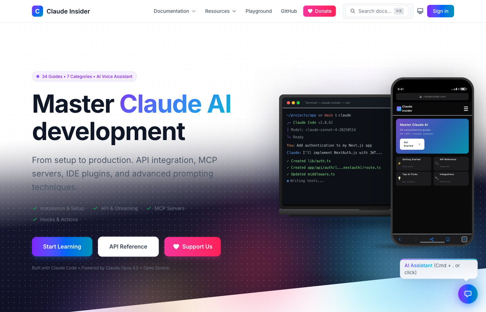
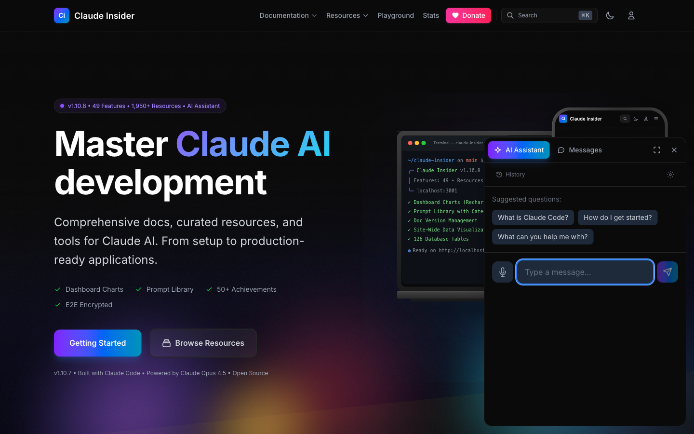
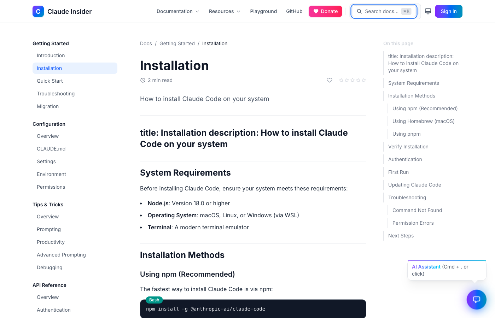
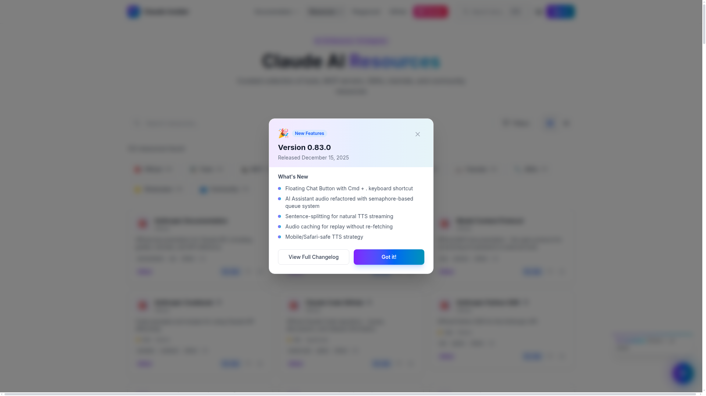

<div align="center">

# Claude Insider

### The Ultimate Documentation Hub for Claude AI

**Created by [Vladimir Dukelic](mailto:vladimir@dukelic.com)** • MIT License with Attribution

<br />

[](https://www.claudeinsider.com)
[](CHANGELOG.md)
[](CLAUDE.md)
[](https://www.claudeinsider.com/resources)
[](https://www.claudeinsider.com/donate)

<br />

*Built entirely with [Claude Code](https://claude.ai/code) powered by Claude Opus 4.5*

</div>

---

<div align="center">



</div>

---

<div align="center">

[**Live Demo**](https://www.claudeinsider.com) &nbsp;•&nbsp; [**Documentation**](https://www.claudeinsider.com/docs/getting-started/installation) &nbsp;•&nbsp; [**Resources**](https://www.claudeinsider.com/resources) &nbsp;•&nbsp; [**Donate**](https://www.claudeinsider.com/donate) &nbsp;•&nbsp; [**Changelog**](CHANGELOG.md)

</div>

---

## Highlights

<table>
<tr>
<td width="50%">

### Stunning Hero Section
Full-viewport landing with **photorealistic device mockups** (MacBook Pro M3 + iPhone 17 Pro Max), animated gradient orbs, and live terminal demo.

### AI Voice Assistant
Chat with Claude AI using voice or text. **ElevenLabs Turbo v2.5** model with **42 premium voices**, **immediate text streaming** with low-latency audio, code block TTS support, and Web Speech API recognition.

### 34 Documentation Pages
Comprehensive guides across **7 categories**: Getting Started, Configuration, API Reference, Integrations, Tutorials, and more.

</td>
<td width="50%">

### 1,952+ Curated Resources
Tools, MCP servers, SDKs, and community resources across **10 categories** with GitHub integration and AI-enhanced metadata.

### Enterprise Security
**End-to-end encryption** (Matrix Olm/Megolm), passkeys/WebAuthn, multi-device 2FA, honeypot bot detection, and trust scoring.

### 50+ Achievements
Gamification system with **9 categories**, 4 rarity tiers, animated confetti, sound effects, and leaderboards.

</td>
</tr>
</table>

---

<div align="center">



*AI Voice Assistant with 42 premium voices, streaming responses, and suggested questions*

</div>

---

## 49 Platform Features

<details>
<summary><b>Content & Documentation</b></summary>

| Feature | Description |
|---------|-------------|
| MDX Documentation | 34 pages with syntax highlighting (33 languages), copy-to-clipboard, ToC with scroll spy |
| Resources Section | 1,952 curated resources, 10 categories, GitHub integration, AI-enhanced descriptions |
| Prompt Library | 10 system prompts, 8 categories, variable syntax, save/rate/use tracking |
| Doc Versioning | Version history, line-by-line diff, unified/split view, rollback capability |
| Cross-Linking | 147 doc-resource + 96 resource-resource relationships with confidence scores |

</details>

<details>
<summary><b>AI & Voice</b></summary>

| Feature | Description |
|---------|-------------|
| AI Voice Assistant | Claude Sonnet 4 streaming, RAG with 6,953 chunks (14% audio-enriched), immediate text streaming |
| ElevenLabs TTS | Turbo v2.5 model, 42 premium voices, low-latency streaming, code block TTS support |
| Speech Recognition | Web Speech API input with real-time transcription |
| AI Writing Assistant | In-place doc editing, 8 AI commands, diff preview, streaming |
| Smart AI Messaging | @claudeinsider auto-responds in DMs, @mention-only in groups |

</details>

<details>
<summary><b>User Features</b></summary>

| Feature | Description |
|---------|-------------|
| Authentication | OAuth (GitHub, Google), email/password, magic links |
| Passkeys/WebAuthn | Face ID, Touch ID, security keys, discoverable credentials |
| Multi-Device 2FA | Multiple authenticators, primary device, backup codes |
| User Profiles | Custom covers (3:1 ratio), location/timezone, social links, share modal |
| Achievement System | 50+ achievements, 9 categories, 4 rarity tiers, confetti effects |

</details>

<details>
<summary><b>Messaging & Social</b></summary>

| Feature | Description |
|---------|-------------|
| Direct Messages | Real-time messaging with typing indicators and online presence |
| Group Chat | Up to 50 members, roles (owner/admin/member), invitations |
| E2EE Messaging | Matrix Olm/Megolm protocol, device verification, cloud backup |
| User Directory | Search, filters, 7 list types, deep linking to messages |
| ProfileHoverCard | Touch-friendly previews, two-touch navigation on mobile |

</details>

<details>
<summary><b>Admin & Security</b></summary>

| Feature | Description |
|---------|-------------|
| Admin Dashboard | 23 pages across 5 sections with animated Recharts visualizations |
| Security Dashboard | Fingerprinting, trust scores, honeypots, activity feed |
| Bot Challenge | Slider puzzle, math captcha, rate limit warnings, trust-based difficulty |
| Audit Export | Bulk exports (JSON/CSV/XLSX), async job queue, anonymization |
| Search Analytics | Top searches, zero-result queries, trend charts |

</details>

<details>
<summary><b>Performance & UX</b></summary>

| Feature | Description |
|---------|-------------|
| Advanced Search | Boolean operators (AND/OR/NOT), smart autocomplete, saved searches |
| Sound Effects | Web Audio API, 26 sound types, 10 themes, 6 categories |
| PWA Support | 15 icons, service worker, push notifications, offline support |
| 18 Languages | Americas, Europe, Asia with automatic locale detection |
| Lighthouse 88+ | FCP 0.8s, LCP 2.2s, TBT 0ms, CLS 0.003 |

</details>

---

<div align="center">



*Syntax-highlighted documentation with sidebar navigation, ToC, and related resources*

</div>

---

## Quick Start

```bash
# Clone and install
git clone https://github.com/siliconyouth/claude-insider.git
cd claude-insider && pnpm install

# Add required API keys to .env.local
ANTHROPIC_API_KEY=your_key_here
ELEVENLABS_API_KEY=your_key_here
BETTER_AUTH_SECRET=your_secret_here  # min 32 chars
NEXT_PUBLIC_SUPABASE_URL=your_url
NEXT_PUBLIC_SUPABASE_ANON_KEY=your_key

# Start development server
pnpm dev
```

> Open [localhost:3001](http://localhost:3001) to view the app

---

<div align="center">



*1,952+ curated resources with interactive charts, category filters, and GitHub stats*

</div>

---

## Tech Stack

<table>
<tr>
<th>Frontend</th>
<th>AI & Voice</th>
<th>Database</th>
<th>Security</th>
</tr>
<tr>
<td>

- Next.js 16
- React 19
- TypeScript 5.9
- Tailwind CSS 4
- Recharts 3.6

</td>
<td>

- Claude Sonnet 4
- ElevenLabs TTS
- Web Speech API
- RAG (3,809 chunks)

</td>
<td>

- Supabase
- PostgreSQL 15+
- 126 Tables
- Payload CMS 3.69

</td>
<td>

- Better Auth 1.4.7
- Passkeys/2FA
- E2EE (Matrix)
- FingerprintJS

</td>
</tr>
</table>

<details>
<summary><b>View full tech stack with versions</b></summary>

<br />

| Category | Technology | Version |
|----------|------------|---------|
| Framework | Next.js (App Router, Turbopack) | 16.0.10 |
| UI Library | React | 19.2.3 |
| Language | TypeScript (strict mode) | 5.9.3 |
| Styling | Tailwind CSS | 4.1.5 |
| Monorepo | Turborepo | 2.6.3 |
| Package Manager | pnpm | 10.19.0 |
| AI Provider | Anthropic SDK | latest |
| Voice | ElevenLabs SDK | latest |
| Search | Fuse.js | 7.1.0 |
| Auth | Better Auth | 1.4.6 |
| Database | Supabase | 2.87.1 |
| CMS | Payload CMS | 3.68.3 |
| Charts | Recharts | 3.6.0 |
| E2EE | Matrix Olm/Megolm WASM | 16.0.0 |
| Fingerprint | FingerprintJS | 5.0.1 |

See [CLAUDE.md](CLAUDE.md) for complete documentation.

</details>

---

## Documentation

| Document | Description |
|:---------|:------------|
| [**CLAUDE.md**](CLAUDE.md) | Development guidelines, design system, UX patterns, 49 feature requirements |
| [**CHANGELOG.md**](CHANGELOG.md) | Version history with detailed release notes |
| [**ROADMAP.md**](ROADMAP.md) | Future feature planning and priorities |

### Documentation Categories

| Category | Pages | Topics |
|:---------|:-----:|:-------|
| Getting Started | 5 | Installation, Quick Start, Troubleshooting, Migration |
| Configuration | 5 | CLAUDE.md, Settings, Environment, Permissions |
| Tips & Tricks | 5 | Prompting, Productivity, Advanced Prompting, Debugging |
| API Reference | 7 | Auth, Tool Use, Streaming, Error Handling, Models |
| Integrations | 7 | MCP Servers, IDE Plugins, Hooks, GitHub Actions, Docker |
| Tutorials | 4 | Code Review, Docs Generation, Test Generation |
| Examples | 2 | Real-World Projects |

---

<div align="center">

## Support This Project

**Claude Insider is free and open source.**
Your support helps cover infrastructure costs and enables continued development.

<br />

[](https://www.claudeinsider.com/donate)

<br />

**Other ways to support:**

Star this repository &nbsp;•&nbsp; Report bugs &nbsp;•&nbsp; Contribute docs &nbsp;•&nbsp; Share with others

</div>

---

## Contributing

```
1. Fork the repository
2. Create your feature branch (git checkout -b feature/amazing)
3. Commit your changes (git commit -m 'Add amazing feature')
4. Push to the branch (git push origin feature/amazing)
5. Open a Pull Request
```

See [CLAUDE.md](CLAUDE.md) for coding standards, design system rules, and contribution guidelines.

---

## License

**MIT License with Attribution**

Copyright © 2025 **Vladimir Dukelic** ([vladimir@dukelic.com](mailto:vladimir@dukelic.com))

When using this software, you must:
1. Link to: https://github.com/siliconyouth/claude-insider
2. Credit: Vladimir Dukelic

---

<div align="center">

### Author

**Vladimir Dukelic**

[vladimir@dukelic.com](mailto:vladimir@dukelic.com) &nbsp;•&nbsp; [@siliconyouth](https://github.com/siliconyouth)

---

[Live Site](https://www.claudeinsider.com) &nbsp;•&nbsp; [Docs](https://www.claudeinsider.com/docs/getting-started/installation) &nbsp;•&nbsp; [Resources](https://www.claudeinsider.com/resources) &nbsp;•&nbsp; [Donate](https://www.claudeinsider.com/donate) &nbsp;•&nbsp; [Changelog](CHANGELOG.md)

<br />

*If Claude Insider helps you, consider [supporting the project](https://www.claudeinsider.com/donate)*

<br />

---

**Built with [Claude Code](https://claude.ai/code)**

</div>
