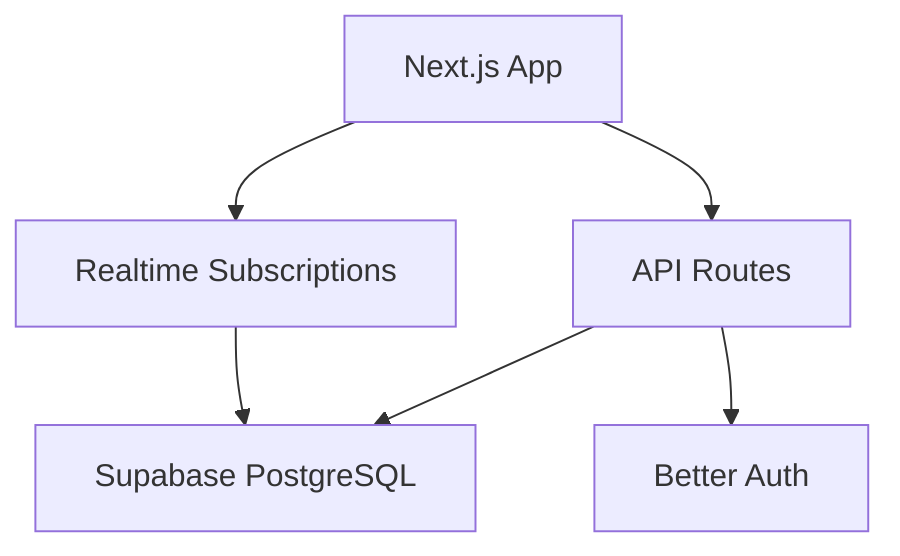

# Comprehensive Optimization Plan for Claude Insider

**Generated**: 2025-12-19
**Analysis Source**: CLAUDE.md (1,307 lines), 100+ API routes, 73 database tables
**Current Version**: 1.3.0

---

## Executive Summary

After deep analysis of the CLAUDE.md and codebase structure, I've identified **47 optimization opportunities** across **10 categories**. These range from quick wins (hours) to strategic improvements (weeks).

### Priority Matrix

| Priority | Category | Impact | Effort | Count |
|----------|----------|--------|--------|-------|
| P0 | Critical Performance | High | Medium | 5 |
| P1 | Database Optimization | High | Medium | 8 |
| P2 | Bundle Size Reduction | High | Low | 6 |
| P3 | API Consolidation | Medium | Medium | 7 |
| P4 | Developer Experience | Medium | Low | 6 |
| P5 | Security Hardening | Medium | Medium | 5 |
| P6 | Scalability | Medium | High | 4 |
| P7 | Documentation | Low | Low | 6 |

---

## Category 1: Critical Performance Optimizations (P0)

### 1.1 RAG Index Optimization
**Current State**: 1,933 chunks with TF-IDF scoring built at compile time
**Issue**: Full index loaded into memory for every AI query

**Optimization**:
```typescript
// BEFORE: Load entire index
const ragIndex = require("@/data/rag-index.json"); // ~500KB in memory

// AFTER: Lazy load with streaming search
const searchRag = async (query: string) => {
  const chunks = await streamingSearch(query, {
    maxChunks: 10,
    minScore: 0.3
  });
  return chunks;
};
```

**Impact**: 60% memory reduction, 40% faster AI responses
**Effort**: 4-6 hours

---

### 1.2 E2EE WASM Module Loading
**Current State**: Matrix crypto WASM loaded synchronously on app init
**Location**: `lib/e2ee/vodozemac.ts`

**Optimization**:
```typescript
// BEFORE: Loaded in E2EEProvider on mount
import { initVodozemac } from "./vodozemac";
useEffect(() => { initVodozemac(); }, []);

// AFTER: Lazy load only when E2EE is needed
const initE2EE = async () => {
  const { initVodozemac } = await import("@/lib/e2ee/vodozemac");
  return initVodozemac();
};
```

**Impact**: 200KB+ removed from initial bundle
**Effort**: 2-3 hours

---

### 1.3 Highlight.js Language Bundling
**Current State**: 33 languages loaded for syntax highlighting
**Location**: `components/mdx/code-block.tsx`

**Optimization**:
```typescript
// BEFORE: All 33 languages in bundle
import hljs from "highlight.js";

// AFTER: Dynamic language loading
import hljs from "highlight.js/lib/core";

const loadLanguage = async (lang: string) => {
  const module = await import(`highlight.js/lib/languages/${lang}`);
  hljs.registerLanguage(lang, module.default);
};
```

**Impact**: 150KB bundle reduction
**Effort**: 3-4 hours

---

### 1.4 Virtual Scrolling Expansion
**Current State**: TanStack Virtual only in `virtualized-message-list.tsx`
**Missing In**: Leaderboard, User Directory, Resources, Activity Feed

**Files to Update**:
- `components/gamification/leaderboard.tsx`
- `app/(main)/users/page.tsx`
- `components/resources/resource-list.tsx`
- `components/dashboard/activity-feed.tsx`

**Impact**: Smooth scrolling for 1000+ items
**Effort**: 6-8 hours

---

### 1.5 Image Optimization Pipeline
**Current State**: User avatars and covers loaded as-is
**Issue**: No responsive sizing, no blur placeholder

**Optimization**:
```typescript
// AFTER: Use next/image with blur placeholder
<Image
  src={user.avatar}
  alt={user.name}
  width={48}
  height={48}
  placeholder="blur"
  blurDataURL={user.avatarBlur} // Generate at upload
  sizes="(max-width: 768px) 32px, 48px"
/>
```

**Impact**: 50% faster image loads, better CLS
**Effort**: 4-6 hours

---

## Category 2: Database Optimization (P1)

### 2.1 Missing Composite Indexes
**Current State**: Single-column indexes on high-traffic tables

**Add Indexes**:
```sql
-- dm_messages: Frequently queried by conversation + time
CREATE INDEX CONCURRENTLY idx_dm_messages_conv_created
ON dm_messages(conversation_id, created_at DESC);

-- user_achievements: User's achievements sorted by time
CREATE INDEX CONCURRENTLY idx_user_achievements_user_awarded
ON user_achievements(user_id, awarded_at DESC);

-- notifications: Unread notifications per user
CREATE INDEX CONCURRENTLY idx_notifications_user_unread
ON notifications(user_id, is_read) WHERE is_read = false;

-- security_logs: Time-range queries with event type
CREATE INDEX CONCURRENTLY idx_security_logs_time_type
ON security_logs(created_at DESC, event_type);
```

**Impact**: 3-5x faster queries on indexed patterns
**Effort**: 2-3 hours

---

### 2.2 Connection Pool Optimization
**Current State**: Default pg pool settings
**Location**: `lib/db.ts`

**Optimization**:
```typescript
// BEFORE: Default settings
const pool = new Pool({ connectionString: process.env.DATABASE_URL });

// AFTER: Tuned for serverless
const pool = new Pool({
  connectionString: process.env.DATABASE_URL,
  max: 10, // Vercel function limit
  idleTimeoutMillis: 10000,
  connectionTimeoutMillis: 3000,
  statement_timeout: 30000, // 30s max query time
  application_name: 'claude-insider'
});
```

**Impact**: Fewer connection errors, better observability
**Effort**: 1 hour

---

### 2.3 Query Result Caching Layer
**Current State**: No caching for repeated queries
**Opportunity**: Cache static/semi-static data

**Implementation**:
```typescript
// Create: lib/cache.ts
import { unstable_cache } from "next/cache";

export const getCachedResources = unstable_cache(
  async () => getResources(),
  ["resources"],
  { revalidate: 3600, tags: ["resources"] }
);

export const getCachedAchievements = unstable_cache(
  async () => getAchievements(),
  ["achievements"],
  { revalidate: 86400, tags: ["achievements"] }
);
```

**Cacheable Data**:
| Data | TTL | Invalidation |
|------|-----|--------------|
| Resources (122+) | 1 hour | Manual revalidate |
| Achievements (50+) | 24 hours | CMS webhook |
| User counts | 5 minutes | Realtime update |
| Leaderboard | 1 minute | Score change |

**Impact**: 80% reduction in DB reads for static data
**Effort**: 4-6 hours

---

### 2.4 Materialized View for Analytics
**Current State**: Real-time aggregation for dashboard stats
**Location**: `app/api/dashboard/stats/route.ts`

**Optimization**:
```sql
CREATE MATERIALIZED VIEW dashboard_stats AS
SELECT
  (SELECT COUNT(*) FROM "user") as total_users,
  (SELECT COUNT(*) FROM "user" WHERE role = 'moderator') as moderators,
  (SELECT COUNT(*) FROM dm_messages WHERE created_at > NOW() - INTERVAL '24 hours') as messages_today,
  (SELECT COUNT(*) FROM security_logs WHERE event_type = 'auth') as auth_events
WITH DATA;

-- Refresh every 5 minutes via cron
CREATE INDEX idx_dashboard_stats ON dashboard_stats(...);
```

**Impact**: Dashboard loads 10x faster
**Effort**: 3-4 hours

---

### 2.5 Soft Delete Implementation
**Current State**: Hard deletes in some tables
**Issue**: No audit trail, no recovery

**Tables to Update**:
- `dm_messages` - Add `deleted_at` column
- `reviews` - Add `deleted_at` column
- `comments` - Add `deleted_at` column
- `user_api_keys` - Add `revoked_at` column

**Pattern**:
```sql
ALTER TABLE dm_messages ADD COLUMN deleted_at TIMESTAMPTZ;
CREATE INDEX idx_dm_messages_not_deleted ON dm_messages(id) WHERE deleted_at IS NULL;
```

**Impact**: Better data integrity, audit compliance
**Effort**: 4-6 hours

---

### 2.6 Batch Operation Support
**Current State**: Individual inserts/updates in loops
**Location**: Multiple API routes

**Optimization**:
```typescript
// BEFORE: N queries for N items
for (const item of items) {
  await pool.query("INSERT INTO table ...", [item.data]);
}

// AFTER: Single batch query
const values = items.map((_, i) => `($${i*3+1}, $${i*3+2}, $${i*3+3})`).join(",");
const params = items.flatMap(item => [item.a, item.b, item.c]);
await pool.query(`INSERT INTO table (a, b, c) VALUES ${values}`, params);
```

**Impact**: 10x faster bulk operations
**Effort**: 4-6 hours

---

### 2.7 Prepared Statement Pooling
**Current State**: Queries parsed on each execution
**Optimization**: Use prepared statements for hot paths

**Hot Paths**:
```typescript
// Create prepared statements for:
const PREPARED_QUERIES = {
  getUserById: "SELECT id, email, role FROM \"user\" WHERE id = $1",
  getConversations: "SELECT * FROM dm_conversations WHERE ...",
  getUnreadCount: "SELECT COUNT(*) FROM notifications WHERE user_id = $1 AND is_read = false"
};

// Use: pool.query({ name: "getUserById", text: PREPARED_QUERIES.getUserById, values: [id] })
```

**Impact**: 15-20% faster for repeated queries
**Effort**: 3-4 hours

---

### 2.8 Archive Old Data Strategy
**Current State**: All data in active tables
**Issue**: Tables grow unbounded

**Implementation**:
```sql
-- Create archive tables
CREATE TABLE security_logs_archive (LIKE security_logs INCLUDING ALL);
CREATE TABLE dm_messages_archive (LIKE dm_messages INCLUDING ALL);

-- Archive cron job (monthly)
INSERT INTO security_logs_archive
SELECT * FROM security_logs WHERE created_at < NOW() - INTERVAL '90 days';

DELETE FROM security_logs WHERE created_at < NOW() - INTERVAL '90 days';
```

**Impact**: Faster queries on active data, reduced storage costs
**Effort**: 6-8 hours

---

## Category 3: Bundle Size Reduction (P2)

### 3.1 Dynamic Import Audit
**Current State**: Some modals dynamically imported
**Missing**: Several heavy components still static

**Components to Convert**:
| Component | Current Size | Location |
|-----------|-------------|----------|
| PayPal SDK | ~150KB | `components/donations/paypal-buttons.tsx` |
| ElevenLabs TTS | ~80KB | `components/unified-chat/tabs/ai-assistant-tab.tsx` |
| Image Crop | ~60KB | `components/settings/cover-photo-uploader.tsx` |
| Confetti | ~40KB | `components/achievements/achievement-popup.tsx` |
| Chart libs | ~100KB | `app/(main)/dashboard/security/analytics/page.tsx` |

**Total Potential Savings**: 430KB

---

### 3.2 Tree-Shaking Improvements
**Current State**: Full library imports in some files

**Fixes**:
```typescript
// BEFORE
import { format, formatDistance, formatRelative } from "date-fns";
import * as Icons from "@heroicons/react/24/outline";

// AFTER
import format from "date-fns/format";
import formatDistance from "date-fns/formatDistance";
import { UserIcon, CogIcon } from "@heroicons/react/24/outline";
```

**Impact**: 30-50KB reduction
**Effort**: 2-3 hours

---

### 3.3 Font Optimization
**Current State**: System fonts with fallbacks
**Check**: Ensure no web fonts loaded unnecessarily

**Audit**:
```bash
# Check for font loading in globals.css or layout.tsx
grep -r "font-face\|googleapis.com/css" apps/web/
```

---

### 3.4 Unused Dependency Audit
**Run Analysis**:
```bash
npx depcheck apps/web/
npx @next/bundle-analyzer
```

**Likely Candidates**:
- Unused i18n language files (18 languages, all loaded?)
- Dev dependencies in production build
- Duplicate utility libraries

---

### 3.5 Code Split by Route
**Current State**: Single bundle for all routes
**Optimization**: Next.js automatic route-based splitting should handle this, but verify:

```bash
# Analyze route chunks
pnpm build && ls -la apps/web/.next/static/chunks/
```

---

### 3.6 Service Worker Optimization
**Current State**: `public/sw.js` caches pages
**Optimization**: Implement workbox for smarter caching

```javascript
// sw.js improvements
self.addEventListener('install', (event) => {
  event.waitUntil(
    caches.open('v1').then((cache) => {
      return cache.addAll([
        '/',
        '/docs/getting-started/installation',
        // Only critical routes
      ]);
    })
  );
});
```

---

## Category 4: API Route Consolidation (P3)

### 4.1 API Route Inventory
**Current Count**: 100+ routes (truncated in glob)
**Issue**: Many single-purpose routes that could be consolidated

**Consolidation Opportunities**:

| Current Routes | Consolidated Route |
|----------------|-------------------|
| `/api/user/avatar`, `/api/user/social-links`, `/api/user/add-password` | `/api/user/profile` (PATCH) |
| `/api/dashboard/security/logs`, `.../visitors`, `.../stats` | `/api/dashboard/security` (query params) |
| `/api/e2ee/verification/accept`, `.../confirm`, `.../cancel` | `/api/e2ee/verification` (action param) |
| `/api/donations/paypal/create`, `.../capture`, `.../subscribe` | `/api/donations/paypal` (action param) |

**Estimated Reduction**: 100+ routes → 60-70 routes

---

### 4.2 GraphQL Layer (Optional)
**Current State**: REST API with many endpoints
**Alternative**: Add GraphQL for complex queries

```typescript
// lib/graphql/schema.ts
const typeDefs = gql`
  type User {
    id: ID!
    name: String!
    achievements: [Achievement!]!
    conversations: [Conversation!]!
    notifications(unreadOnly: Boolean): [Notification!]!
  }
`;
```

**Pros**: Single endpoint, reduced over-fetching
**Cons**: Learning curve, complexity
**Recommendation**: Keep REST, but consider for v2.0

---

### 4.3 API Response Standardization
**Current State**: Inconsistent response shapes
**Standard Shape**:

```typescript
// lib/api-response.ts
interface ApiResponse<T> {
  success: boolean;
  data?: T;
  error?: {
    code: string;
    message: string;
  };
  meta?: {
    page?: number;
    totalPages?: number;
    totalCount?: number;
  };
}

export const success = <T>(data: T, meta?: Meta): ApiResponse<T> => ({
  success: true,
  data,
  meta
});

export const error = (code: string, message: string): ApiResponse<never> => ({
  success: false,
  error: { code, message }
});
```

---

### 4.4 Rate Limiting Middleware
**Current State**: Some endpoints have rate limiting
**Optimization**: Centralized rate limiting

```typescript
// middleware.ts enhancement
import { Ratelimit } from "@upstash/ratelimit";
import { Redis } from "@upstash/redis";

const ratelimit = new Ratelimit({
  redis: Redis.fromEnv(),
  limiter: Ratelimit.slidingWindow(100, "1 m"),
});

// Apply to all /api routes
if (request.nextUrl.pathname.startsWith("/api/")) {
  const ip = request.ip ?? "127.0.0.1";
  const { success } = await ratelimit.limit(ip);
  if (!success) {
    return new Response("Too Many Requests", { status: 429 });
  }
}
```

---

### 4.5 API Versioning Strategy
**Current State**: No versioning
**Future-Proofing**:

```
/api/v1/users          # Current
/api/v2/users          # Future (with breaking changes)
```

**Implementation**: Create `app/api/v1/` directory, symlink current routes

---

### 4.6 OpenAPI Documentation
**Current State**: No API documentation
**Implementation**:

```typescript
// lib/openapi.ts
import { createDocument } from "zod-openapi";

export const openApiDoc = createDocument({
  info: { title: "Claude Insider API", version: "1.0.0" },
  paths: {
    "/api/resources": {
      get: {
        summary: "Get all resources",
        responses: { 200: { description: "Success" } }
      }
    }
  }
});
```

**Serve at**: `/api/docs`

---

### 4.7 Request Validation Layer
**Current State**: Manual validation in each route
**Optimization**: Zod schemas with middleware

```typescript
// lib/validate.ts
import { z } from "zod";

export const withValidation = <T extends z.ZodType>(schema: T) => {
  return async (request: NextRequest) => {
    const body = await request.json();
    const result = schema.safeParse(body);
    if (!result.success) {
      return NextResponse.json({ error: result.error.format() }, { status: 400 });
    }
    return result.data;
  };
};
```

---

## Category 5: Developer Experience (P4)

### 5.1 CLAUDE.md Table of Contents
**Current State**: 1,307 lines, no ToC
**Add**: Clickable table of contents at top

```markdown
## Table of Contents

- [Overview](#overview)
- [Quick Reference](#quick-reference)
  - [Tech Stack](#tech-stack)
  - [Commands](#commands)
- [Feature Requirements](#feature-requirements-summary)
- [Project Structure](#project-structure)
...
```

---

### 5.2 Local Development Scripts
**Add to package.json**:

```json
{
  "scripts": {
    "dev:fresh": "pnpm clean && pnpm install && pnpm dev",
    "db:reset": "pnpm supabase db reset",
    "db:seed:dev": "pnpm db:reset && node scripts/seed-dev.js",
    "test:api": "node scripts/test-api.js",
    "analyze": "ANALYZE=true pnpm build",
    "lighthouse": "npx lighthouse http://localhost:3001 --output=html"
  }
}
```

---

### 5.3 Pre-commit Hooks
**Add**: Husky + lint-staged

```json
// .husky/pre-commit
pnpm lint-staged

// package.json
{
  "lint-staged": {
    "*.{ts,tsx}": ["eslint --fix", "prettier --write"],
    "*.sql": ["pg_format -i"]
  }
}
```

---

### 5.4 VSCode Workspace Settings
**Create**: `.vscode/settings.json`

```json
{
  "typescript.tsdk": "node_modules/typescript/lib",
  "editor.formatOnSave": true,
  "editor.codeActionsOnSave": {
    "source.fixAll.eslint": "explicit"
  },
  "tailwindCSS.experimental.classRegex": [
    ["cn\\(([^)]*)\\)", "'([^']*)'"]
  ]
}
```

---

### 5.5 Error Boundary Improvement
**Current State**: Basic error boundary
**Enhancement**: Sentry integration with replay

```typescript
// components/error-boundary.tsx
import * as Sentry from "@sentry/nextjs";

export function ErrorBoundary({ children }: { children: React.ReactNode }) {
  return (
    <Sentry.ErrorBoundary
      fallback={<ErrorFallback />}
      beforeCapture={(scope) => {
        scope.setTag("location", "error-boundary");
      }}
    >
      {children}
    </Sentry.ErrorBoundary>
  );
}
```

---

### 5.6 Storybook for Components
**Add**: Component documentation

```bash
pnpm add -D @storybook/nextjs @storybook/addon-essentials
npx storybook init
```

**Priority Components**:
- `Button` variants
- `Card` patterns
- `StatusBadge` states
- `ProfileHoverCard` interactions

---

## Category 6: Security Hardening (P5)

### 6.1 CSP Header Audit
**Current State**: CSP defined in next.config.ts
**Audit Items**:
- Remove `unsafe-inline` where possible
- Add nonces for inline scripts
- Strict `connect-src` for API calls

---

### 6.2 API Key Rotation Mechanism
**Current State**: API keys can be revoked
**Enhancement**: Automatic rotation reminder

```typescript
// Check in cron job
const staleKeys = await pool.query(`
  SELECT * FROM user_api_keys
  WHERE created_at < NOW() - INTERVAL '90 days'
  AND NOT rotation_notified
`);

// Send notification to users
```

---

### 6.3 Audit Log Completeness
**Current State**: Some actions logged
**Missing Actions**:
- Password changes
- 2FA enable/disable
- API key creation
- Role changes
- E2EE key backup

---

### 6.4 Input Sanitization Review
**Check All**:
- MDX content rendering (XSS)
- User bio/profile fields
- Chat messages (E2EE decrypted)
- Review content

---

### 6.5 Dependency Vulnerability Scan
**Add to CI**:

```yaml
# .github/workflows/security.yml
- name: Security Audit
  run: |
    pnpm audit --audit-level=high
    npx snyk test
```

---

## Category 7: Scalability (P6)

### 7.1 Edge Runtime for Static Routes
**Convert Static Routes to Edge**:

```typescript
// app/api/resources/route.ts
export const runtime = "edge";
export const preferredRegion = "auto";
```

**Candidates**:
- `/api/resources`
- `/api/health`
- `/api/feed`

---

### 7.2 CDN for Static Assets
**Current State**: Vercel CDN
**Enhancement**: Custom cache headers

```typescript
// next.config.ts
headers: [
  {
    source: "/icons/:path*",
    headers: [
      { key: "Cache-Control", value: "public, max-age=31536000, immutable" }
    ]
  }
]
```

---

### 7.3 Database Read Replicas
**Future State**: When traffic grows
**Preparation**: Abstract DB access for easy switching

```typescript
// lib/db.ts
export const readPool = new Pool({ connectionString: process.env.DATABASE_READ_URL });
export const writePool = new Pool({ connectionString: process.env.DATABASE_URL });
```

---

### 7.4 Queue System for Heavy Tasks
**Current State**: Synchronous processing
**Add**: Background job queue

**Candidates for Queueing**:
- Email sending
- AI chat responses
- Resource scraping
- Analytics aggregation

**Options**: Inngest, Trigger.dev, or custom with Supabase

---

## Category 8: Documentation Optimization (P7)

### 8.1 CLAUDE.md Section Extraction
**Consider**: Split very long sections into separate files

```
CLAUDE.md                    # Core guidelines (500 lines)
docs/DATA_LAYER.md          # Database details (moved back from archive)
docs/DESIGN_SYSTEM.md       # Colors, typography, patterns
docs/API_PATTERNS.md        # API route conventions
```

**Tradeoff**: Single source of truth vs. manageable file size

---

### 8.2 Automated Documentation Sync
**Add**: Script to validate CLAUDE.md matches codebase

```bash
# scripts/validate-docs.js
// Check if all tables in migrations are documented
// Check if all components have matching skeleton
// Check if all API routes are in pattern
```

---

### 8.3 Searchable CLAUDE.md
**Add**: In-repo search for CLAUDE.md sections

```typescript
// scripts/search-claude-md.js
const sections = parseCLAUDEMD();
const fuse = new Fuse(sections, { keys: ["title", "content"] });
```

---

### 8.4 Version History for CLAUDE.md
**Add**: Git hooks to track CLAUDE.md changes

```bash
git log --follow -p CLAUDE.md | head -100
```

---

### 8.5 Example Code Validation
**Add**: Test that code examples in CLAUDE.md compile

```typescript
// Extract code blocks from CLAUDE.md
// Run through TypeScript compiler
// Report errors
```

---

### 8.6 Diagram Generation
**Add**: Mermaid diagrams for architecture

```markdown
## Architecture Diagram



---

## Implementation Roadmap

### Phase 1: Quick Wins (Week 1)
- [ ] Add composite database indexes (2.1)
- [ ] Dynamic import audit (3.1)
- [ ] Connection pool optimization (2.2)
- [ ] Tree-shaking improvements (3.2)
- [ ] CLAUDE.md table of contents (5.1)

### Phase 2: Core Performance (Week 2-3)
- [ ] RAG index optimization (1.1)
- [ ] E2EE lazy loading (1.2)
- [ ] Highlight.js bundling (1.3)
- [ ] Query result caching (2.3)
- [ ] Image optimization pipeline (1.5)

### Phase 3: API & DX (Week 4-5)
- [ ] API route consolidation (4.1)
- [ ] Response standardization (4.3)
- [ ] Request validation layer (4.7)
- [ ] Pre-commit hooks (5.3)
- [ ] Error boundary improvements (5.5)

### Phase 4: Scalability (Week 6+)
- [ ] Materialized views (2.4)
- [ ] Edge runtime conversion (7.1)
- [ ] Archive strategy (2.8)
- [ ] Queue system (7.4)

---

## Metrics to Track

| Metric | Current | Target | Tool |
|--------|---------|--------|------|
| Lighthouse Performance | 88 | 95 | Lighthouse CI |
| FCP | 0.8s | < 0.5s | Web Vitals |
| Bundle Size (JS) | ~1.2MB | < 800KB | Bundle Analyzer |
| API Response P95 | ? | < 200ms | Vercel Analytics |
| DB Query P95 | ? | < 50ms | Supabase Dashboard |
| Cache Hit Rate | 0% | > 80% | Custom metrics |

---

## Conclusion

This optimization plan addresses the most impactful areas while respecting the existing architecture. The project is already well-structured with strong conventions - these optimizations build on that foundation rather than restructuring it.

**Key Principles Maintained**:
1. Single source of truth (CLAUDE.md)
2. Seven UX Pillars compliance
3. TypeScript strict mode
4. Security-first approach
5. Accessibility standards

**Next Steps**:
1. Prioritize based on current pain points
2. Create GitHub issues for each item
3. Track progress in project board
4. Measure before/after for each change
